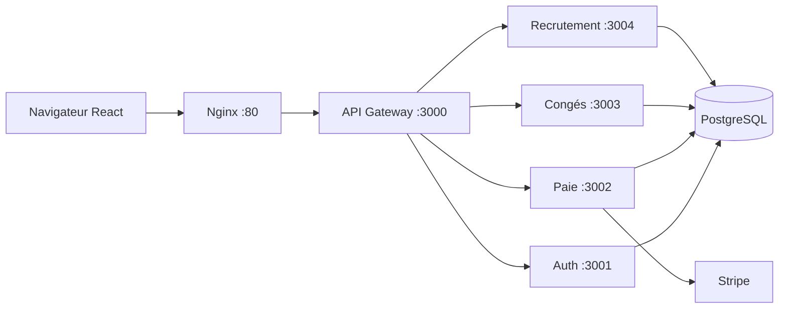
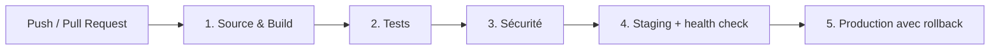

# Architecture cible CI/CD - Jour 1

## Architecture applicative existante

Redis est déclaré dans l'environnement, mais son usage n'est pas présent dans le code fourni. L'infrastructure annoncée est un VPS OVH sans définition versionnée.

## Pipeline cible

Le workflow du Jour 1 implémente le premier contrôle de build, lint et syntaxe JavaScript. Les stages de tests métier, sécurité et déploiement seront complétés aux jours suivants.
